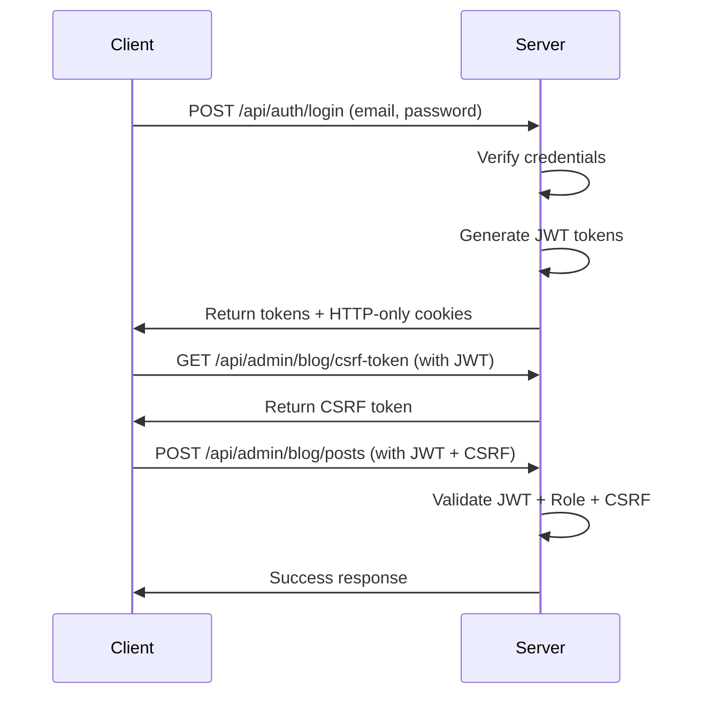

# Admin Blog Panel - Complete Documentation

## 🔒 Security Features

This admin panel implements **enterprise-grade security** to ensure only authorized administrators can manage blog content.

### Security Layers

1. **JWT Authentication** - Industry-standard token-based authentication
2. **Role-Based Access Control (RBAC)** - Only users with `ADMIN` role can access
3. **CSRF Protection** - Custom CSRF token validation for all state-changing operations
4. **Rate Limiting** - Prevents brute-force attacks
5. **Input Validation** - Zod schemas validate all inputs
6. **File Upload Security** - Image validation, size limits, type checking
7. **Password Hashing** - bcrypt with salt rounds for secure password storage
8. **HTTP-Only Cookies** - Tokens stored securely, not accessible via JavaScript
9. **Helmet.js** - Sets secure HTTP headers
10. **MongoDB Sanitization** - Prevents NoSQL injection attacks

### Authentication Flow



---

## 📡 API Endpoints

Base URL: `http://localhost:5000/api/admin/blog`

### Authentication Required
All endpoints require:
- Valid JWT token (in `Authorization: Bearer <token>` header OR `accessToken` cookie)
- User role: `ADMIN`
- CSRF token (for POST/PUT/DELETE operations in `x-csrf-token` header)

---

## 🔐 CSRF Protection

### Getting CSRF Token

```javascript
GET /api/admin/blog/csrf-token

Headers:
  Authorization: Bearer <your-jwt-token>

Response:
{
  "success": true,
  "message": "CSRF token generated",
  "data": {
    "csrfToken": "abc123..."
  }
}
```

### Using CSRF Token

For all state-changing operations (POST, PUT, DELETE):

```javascript
POST /api/admin/blog/posts

Headers:
  Authorization: Bearer <your-jwt-token>
  x-csrf-token: <csrf-token>
  Content-Type: application/json

Body: { ...post data }
```

---

## 📝 Blog Post Management

### Get All Posts (Including Drafts)

```bash
GET /api/admin/blog/posts?page=1&limit=10&published=false

Query Parameters:
- page: number (default: 1)
- limit: number (default: 10, max: 50)
- tag: string (filter by tag)
- category: string (filter by category)
- featured: boolean (true/false)
- search: string (full-text search)
- published: boolean (true for published, false for drafts, omit for all)

Response:
{
  "success": true,
  "message": "Posts retrieved successfully",
  "data": {
    "data": [
      {
        "_id": "...",
        "slug": "my-post",
        "title": "My Post",
        "description": "...",
        "author": "Admin",
        "publishedAt": "2025-01-01T00:00:00.000Z",
        "tags": ["nextjs", "tutorial"],
        "category": "engineering",
        "featured": false,
        "published": false,
        "views": 0,
        "likes": 0,
        "createdAt": "2025-01-01T00:00:00.000Z",
        "updatedAt": "2025-01-01T00:00:00.000Z"
      }
    ],
    "pagination": {
      "page": 1,
      "limit": 10,
      "total": 25,
      "totalPages": 3,
      "hasNext": true,
      "hasPrev": false
    }
  }
}
```

### Get Single Post

```bash
GET /api/admin/blog/posts/:slug

Response:
{
  "success": true,
  "message": "Post retrieved successfully",
  "data": {
    "post": {
      // Full post object including content
    }
  }
}
```

### Create New Post

```bash
POST /api/admin/blog/posts

Headers:
  Authorization: Bearer <token>
  x-csrf-token: <csrf-token>
  Content-Type: application/json

Body:
{
  "title": "My New Post",
  "description": "A detailed description of my post (min 20 chars)",
  "content": "# Introduction\n\nFull markdown content here...",
  "excerpt": "Optional custom excerpt",
  "author": "Your Name",
  "tags": ["nextjs", "tutorial"],
  "category": "engineering",
  "coverImage": "/uploads/blog/covers/image.webp",
  "featured": false,
  "published": false, // false = draft, true = published
  "series": {
    "name": "Next.js Tutorial Series",
    "order": 1
  },
  "seo": {
    "metaTitle": "Custom SEO Title",
    "metaDescription": "Custom meta description",
    "keywords": ["nextjs", "react"],
    "canonicalUrl": "https://yourdomain.com/blog/my-post"
  }
}

Response:
{
  "success": true,
  "message": "Post created successfully",
  "data": {
    "post": { ... }
  }
}
```

### Update Post

```bash
PUT /api/admin/blog/posts/:slug

Headers:
  Authorization: Bearer <token>
  x-csrf-token: <csrf-token>
  Content-Type: application/json

Body:
{
  "title": "Updated Title",
  "content": "Updated content...",
  // ... any fields to update
}
```

### Delete Post

```bash
DELETE /api/admin/blog/posts/:slug

Headers:
  Authorization: Bearer <token>
  x-csrf-token: <csrf-token>
```

### Publish Draft

```bash
POST /api/admin/blog/posts/:slug/publish

Headers:
  Authorization: Bearer <token>
  x-csrf-token: <csrf-token>

Response:
{
  "success": true,
  "message": "Post published successfully",
  "data": {
    "post": { ... }
  }
}
```

### Unpublish Post (Make Draft)

```bash
POST /api/admin/blog/posts/:slug/unpublish

Headers:
  Authorization: Bearer <token>
  x-csrf-token: <csrf-token>
```

---

## 🖼️ Image Upload

### Upload Cover Image

```bash
POST /api/admin/blog/upload/cover

Headers:
  Authorization: Bearer <token>
  x-csrf-token: <csrf-token>
  Content-Type: multipart/form-data

Body (form-data):
  image: <file>

Constraints:
- Max size: 5MB
- Allowed types: JPEG, PNG, WebP
- Min dimensions: 800x400px
- Auto-converted to WebP
- Auto-resized to 1200x630px (cover fit)

Response:
{
  "success": true,
  "message": "Cover image uploaded successfully",
  "data": {
    "url": "/uploads/blog/covers/1234567890-abc123.webp"
  }
}
```

### Upload Inline Image

```bash
POST /api/admin/blog/upload/inline

Headers:
  Authorization: Bearer <token>
  x-csrf-token: <csrf-token>
  Content-Type: multipart/form-data

Body (form-data):
  image: <file>

Constraints:
- Max size: 10MB
- Allowed types: JPEG, PNG, WebP
- Auto-converted to WebP
- Max width: 1000px (maintains aspect ratio)

Response:
{
  "success": true,
  "message": "Image uploaded successfully",
  "data": {
    "url": "/uploads/blog/inline/1234567890-xyz789.webp"
  }
}
```

### Upload Multiple Images

```bash
POST /api/admin/blog/upload/multiple

Headers:
  Authorization: Bearer <token>
  x-csrf-token: <csrf-token>
  Content-Type: multipart/form-data

Body (form-data):
  images: <file[]> (max 10 files)

Response:
{
  "success": true,
  "message": "Images uploaded successfully",
  "data": {
    "urls": [
      "/uploads/blog/inline/123.webp",
      "/uploads/blog/inline/456.webp"
    ]
  }
}
```

### Delete Image

```bash
DELETE /api/admin/blog/upload

Headers:
  Authorization: Bearer <token>
  x-csrf-token: <csrf-token>
  Content-Type: application/json

Body:
{
  "url": "/uploads/blog/inline/123.webp"
}
```

---

## 🏷️ Category Management

### Get All Categories

```bash
GET /api/admin/blog/categories

Response:
{
  "success": true,
  "data": {
    "categories": [
      {
        "_id": "...",
        "slug": "engineering",
        "name": "Engineering",
        "description": "Engineering posts",
        "icon": "⚙️",
        "color": "#3B82F6",
        "order": 1,
        "postCount": 12
      }
    ]
  }
}
```

### Create Category

```bash
POST /api/admin/blog/categories

Headers:
  Authorization: Bearer <token>
  x-csrf-token: <csrf-token>

Body:
{
  "slug": "engineering",
  "name": "Engineering",
  "description": "Engineering and technical posts",
  "icon": "⚙️",
  "color": "#3B82F6",
  "order": 1
}
```

### Update Category

```bash
PUT /api/admin/blog/categories/:slug

Headers:
  Authorization: Bearer <token>
  x-csrf-token: <csrf-token>

Body:
{
  "name": "Updated Name",
  // ... fields to update
}
```

### Delete Category

```bash
DELETE /api/admin/blog/categories/:slug

Headers:
  Authorization: Bearer <token>
  x-csrf-token: <csrf-token>

Note: Cannot delete categories with existing posts
```

---

## 🏷️ Tag Management

### Get All Tags

```bash
GET /api/admin/blog/tags
```

### Create Tag

```bash
POST /api/admin/blog/tags

Headers:
  Authorization: Bearer <token>
  x-csrf-token: <csrf-token>

Body:
{
  "slug": "nextjs",
  "name": "Next.js",
  "description": "Next.js framework posts"
}
```

### Update Tag

```bash
PUT /api/admin/blog/tags/:slug
```

### Delete Tag

```bash
DELETE /api/admin/blog/tags/:slug

Note: Cannot delete tags with existing posts
```

---

## 📚 Series Management

### Get All Series

```bash
GET /api/admin/blog/series
```

### Create Series

```bash
POST /api/admin/blog/series

Headers:
  Authorization: Bearer <token>
  x-csrf-token: <csrf-token>

Body:
{
  "slug": "nextjs-tutorial",
  "name": "Next.js Tutorial Series",
  "description": "Learn Next.js from scratch",
  "coverImage": "/uploads/blog/covers/series.webp"
}
```

### Update Series

```bash
PUT /api/admin/blog/series/:slug
```

### Delete Series

```bash
DELETE /api/admin/blog/series/:slug

Note: Cannot delete series with existing posts
```

---

## 📊 Statistics

### Get Blog Stats

```bash
GET /api/admin/blog/stats

Response:
{
  "success": true,
  "message": "Stats retrieved successfully",
  "data": {
    "totalPosts": 50,
    "publishedPosts": 35,
    "draftPosts": 15,
    "totalViews": 12345,
    "totalLikes": 678,
    "totalCategories": 5,
    "totalTags": 25
  }
}
```

---

## 🚨 Error Handling

All errors follow this format:

```json
{
  "success": false,
  "message": "Error description",
  "error": "Additional error details"
}
```

### Common HTTP Status Codes

- `200` - Success
- `201` - Created
- `400` - Bad Request (validation error)
- `401` - Unauthorized (missing or invalid token)
- `403` - Forbidden (CSRF error or insufficient permissions)
- `404` - Not Found
- `409` - Conflict (duplicate slug)
- `422` - Validation Error
- `500` - Internal Server Error

---

## 🛡️ Security Best Practices

### 1. Token Management

```javascript
// Store access token in memory (not localStorage!)
let accessToken = null;

// On login
const response = await fetch('/api/auth/login', {
  method: 'POST',
  credentials: 'include', // Important for cookies
  headers: { 'Content-Type': 'application/json' },
  body: JSON.stringify({ email, password })
});

const data = await response.json();
accessToken = data.data.accessToken; // Store in memory
```

### 2. Making Authenticated Requests

```javascript
// Get CSRF token first
const csrfResponse = await fetch('/api/admin/blog/csrf-token', {
  headers: {
    'Authorization': `Bearer ${accessToken}`
  },
  credentials: 'include'
});

const { data: { csrfToken } } = await csrfResponse.json();

// Then make your request
const response = await fetch('/api/admin/blog/posts', {
  method: 'POST',
  headers: {
    'Authorization': `Bearer ${accessToken}`,
    'x-csrf-token': csrfToken,
    'Content-Type': 'application/json'
  },
  credentials: 'include',
  body: JSON.stringify(postData)
});
```

### 3. Token Refresh

```javascript
// If you get 401, refresh the token
if (response.status === 401) {
  const refreshResponse = await fetch('/api/auth/refresh', {
    method: 'POST',
    credentials: 'include'
  });

  if (refreshResponse.ok) {
    const data = await refreshResponse.json();
    accessToken = data.data.accessToken;
    // Retry original request
  } else {
    // Redirect to login
  }
}
```

---

## ⚠️ Important Notes

1. **CSRF Tokens Expire**: CSRF tokens expire after 24 hours. Get a fresh one if requests fail with 403.

2. **Image URLs**: All image URLs are relative (`/uploads/blog/...`). Prepend your domain in production.

3. **Slug Uniqueness**: Slugs must be unique. Auto-generated from title if not provided.

4. **Draft vs Published**: By default, new posts are drafts (`published: false`). Use the publish endpoint or set `published: true`.

5. **File Uploads**: Always use `multipart/form-data` for file uploads.

6. **Rate Limiting**: Admin endpoints have stricter rate limits. If you hit the limit, wait before retrying.

7. **Database Cleanup**: Deleting a post doesn't delete associated images automatically (for now). Delete images manually if needed.

---

## 🔧 Environment Variables

Make sure these are set in your `.env`:

```env
# JWT Configuration
JWT_ACCESS_SECRET=your-super-secret-access-key
JWT_REFRESH_SECRET=your-super-secret-refresh-key
JWT_ACCESS_EXPIRY=15m
JWT_REFRESH_EXPIRY=7d

# Cookie Configuration
COOKIE_SECURE=false  # Set to true in production (requires HTTPS)
COOKIE_DOMAIN=localhost

# CORS
CORS_ORIGIN=http://localhost:3000

# Server
PORT=5000
NODE_ENV=development  # Set to 'production' in production
```

---

## 🎯 Next Steps

1. Set up your frontend admin panel
2. Implement authentication flow
3. Create blog post editor with markdown support
4. Add image upload UI
5. Implement preview functionality
6. Test all security features

For frontend integration guide, see [FRONTEND_INTEGRATION.md](./FRONTEND_INTEGRATION.md)
